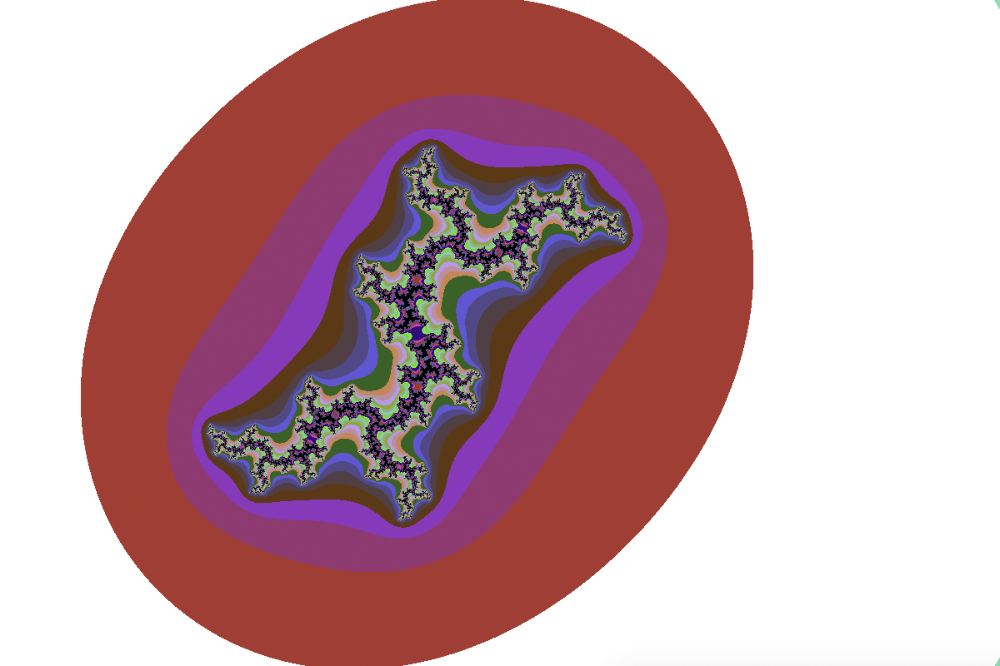

# Fract'ol

## Description

Ce projet a pour but de créer des fractales



## Installation

``` bash
$> git clone https://github.com/bmoiroud/fractol.git && cd fractol && make
```

## Utilisation

``` bash
$> ./fractol <numero_fractale>
```

| Touche      | Action         |
|:-----------:|:---------------|
| H           | aide           |
| R           | réinitialiser la vue  |
| Esc         | quitter        |
| Espace         | modifier la fractale |
| Touches fléchées     | déplacement    |
| Molette de la souris | zoom           |

